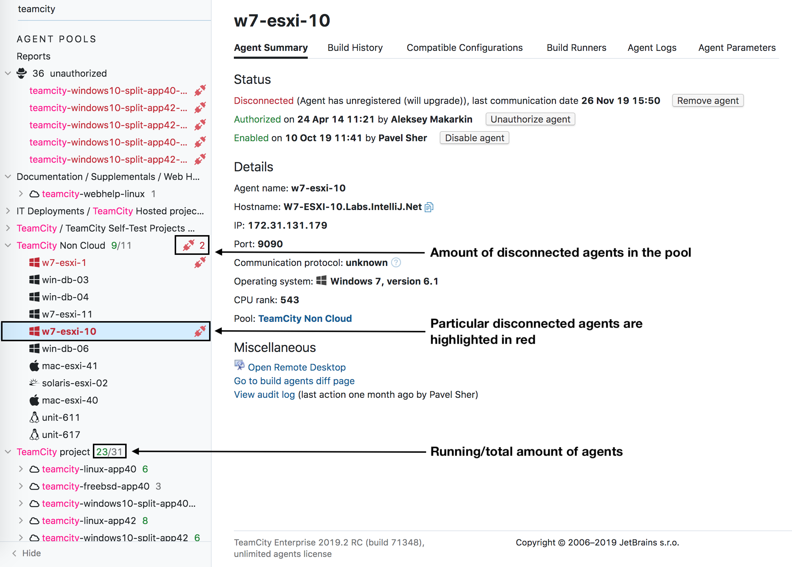

# Agent Pages
All of the tabs on the __Agent Page__ will be reworked in the near future. 

At first, we will focus on the tabs below: 
* Connected :oncoming_automobile:
* Disconnected :oncoming_automobile:
* Unauthorized :oncoming_automobile:

## Master-Detail Principle 
After getting a lot of positive feedback on the sidebar for our overiew pages, 
we decided to use the same master-detail principle for the __Agent Pages__.

Using the sidebar itself, you will be able to:
* Globally search your agents :checkered_flag:
* View agents grouped by pools :checkered_flag: 
* Check the status of those agents :checkered_flag: 
    * Check the amount of disconnected or idle agents 
    * Check the agent's OS

Whenever you select an agent in the sidebar, more information on that agent will 
be displayed on the right. 

