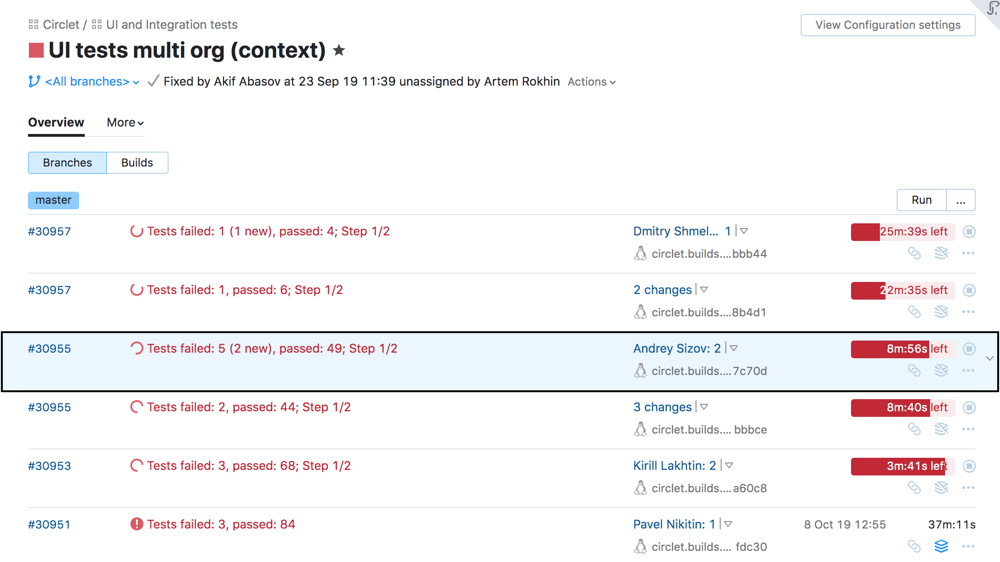
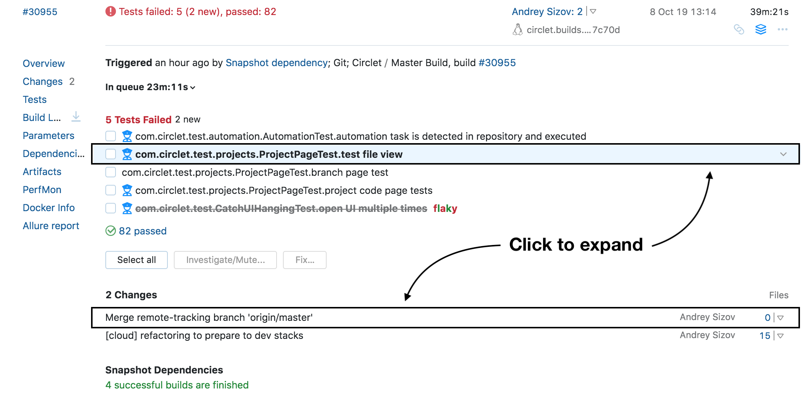

# Build Overview

Whenever you want to inspect a specific build in a configuration, first thing
you will see is the __Build Row__. __Build rows__ are visible both in the 
__Build Configuration Overview__ and the [cards](ProjectOverview.md#trend-cards) in the __Project Overview__.

## Build Row

Each __Build Row__ represents a single build in the build configuration. It contains
following information:

* Project/build configuration :checkered_flag: 
* Branch :checkered_flag: 
* Number :checkered_flag: 
* Favorite :checkered_flag: 
* Personal :checkered_flag: 
* State :checkered_flag: 
    * Running
    * Finished
    * Canceled
    * Failed to start
* Status :checkered_flag: 
    * Successful
    * Failed
* Pin/tags :checkered_flag: 
* Artifacts :checkered_flag: 
* Agent :checkered_flag: 
    * Agent Pool
* Dependencies (chain icon) :checkered_flag: 
* Comment :checkered_flag: 

## Expanded Build Row

You can click on the free space anywhere in the __Build Row__ and it will expand.

The __Expanded Build Row__ adds more details about the build:

* Timeline :checkered_flag: 
* Build log tail :checkered_flag: 
* Extensions 
	* Code coverage :checkered_flag: 
    * Install in Toolbox :oncoming_automobile:
* X build problems :checkered_flag: 
* Tests counters :checkered_flag: 
* X failed test :checkered_flag: 
* X latest changes (ordered by time) :checkered_flag: 
	* In the code
	* In the configuration
* Snapshot dependencies overview :checkered_flag: 
* Deployments :checkered_flag: 

## Build Overview Page

For in-depth information, you can open the __Build Overview Page__.

You will see an overview of the build, which includes all the information present
in the __Expanded Build Row__ and more.  
 
### Build Timeline, Build Log

The new __Build Log__ window displays a preview of the log. Upon clicking on it, 
the full build log will pop up.

* Improved performance :checkered_flag: 
* Clickable build log :checkered_flag: 
* Build steps :oncoming_automobile:
 
In the pop-up, new features are supported:

* Dynamic loading of the log :checkered_flag: 
* Keyboard navigation :checkered_flag: 

### Failed Tests

  

* Counters :checkered_flag:  
* Failed test line :checkered_flag: 

### Changes

* X latest changes (ordered by time) :checkered_flag: 
    * In the code
    * In the configuration
    * To the artifacts
* My changes :oncoming_automobile: 

### Snapshot Dependencies

  

* An overview of the successful/failed dependencies 

