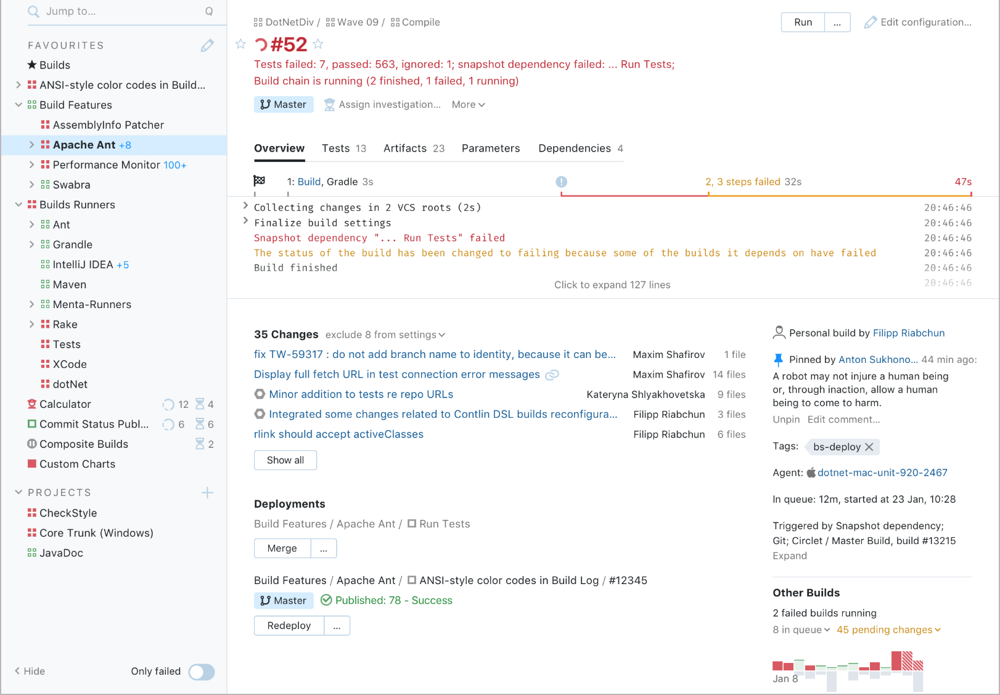
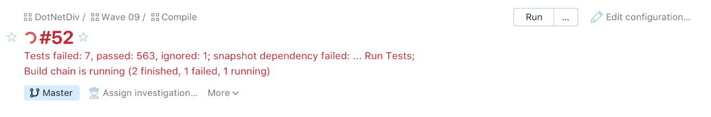
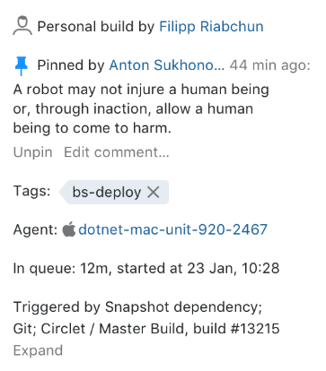

# Build Overview
The __Build Overview__ page is displayed whenever you select a specific build.
We understand the importance of this page, it is one of the core parts of the [Sakura](Sakura.md) 
update.

The new __Build Overview__ page will contain information on the following topics:

* General data :checkered_flag: 
* Build artifacts :checkered_flag: 
* Changes (first 5) :oncoming_automobile:
* Build problems (first 5) :oncoming_automobile:
* Dependencies :oncoming_automobile:
* Build log :oncoming_automobile:

## Header

* Breadcrumbs :checkered_flag:  
* Project/build configuration :checkered_flag: 
* Number :checkered_flag: 
* Title :checkered_flag: 
* Branch selector 
* Status :checkered_flag: 
* State :checkered_flag: 
* Add to favorites :checkered_flag: 
* Description :checkered_flag: 
* Investigation (assign/view) :checkered_flag: 

## Tabs 

* Overview  :checkered_flag: 
    * Build info
    * Build details
* Tests :oncoming_automobile:
    * Filters
        * By name
        * By status
    * Timeline
  	* List/tree
* Build log :oncoming_automobile:
    * Timeline
    * Flame chart
* Snapshot dependencies :oncoming_automobile:

## Build Timeline

* Build steps :oncoming_automobile:
* Clickable error :oncoming_automobile: 

[//]: <> ( ## Build Log)

## Changes

* X latest changes (ordered by time)
    * In the code
    * In the configuration

## Tests

* Counters 
* Failed test line

## Build Details

[//]: <> ()

* Timeline
* Build log tail
* Extensions
    * Code coverage
    * Install in Toolbox
* X build problems
* Tests counters
* X failed test
* X latest changes (ordered by time)
    * In the code
    * In the configuration
* Snapshot dependencies overview
* Deployments

[//]: <> ( ## Other Builds)
