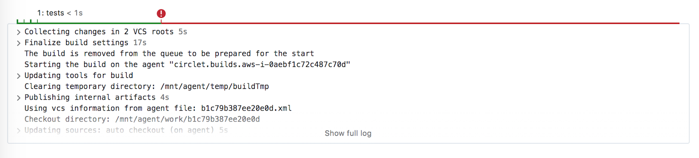
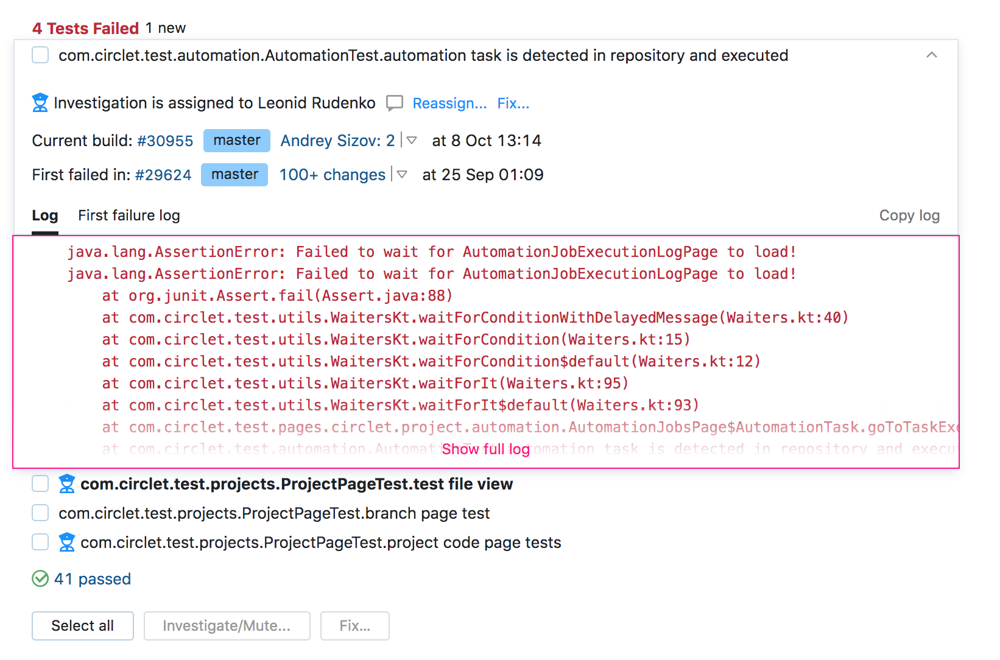
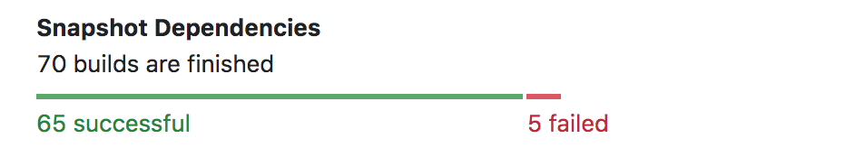

# Build Page

The __Build Page__ consists of multiple tabs. Whenever you select a specific build,
you end up on the overview tab.  
The overview has all the crucial information in one place: build duration, 
changes, problems, tests, dependencies. If you are interested in something specific,
you can check the dedicated tab. 

## Our Progress

* Build log:
    * Improved performance :checkered_flag: 
    * Clickable timeline :checkered_flag: 
    * Build steps :oncoming_automobile:
    * New features in pop-up:
        * Dynamic loading of the log :checkered_flag: 
        * Keyboard navigation :checkered_flag: 
* Failed tests:
    * Counters :checkered_flag:  
    * Expandable failed test line :checkered_flag: 
* Changes:
    * Expandable latest changes (ordered by time) :checkered_flag: 
        * In the code
        * In the configuration
        * To the artifacts
    * My changes :oncoming_automobile: 
* Snapshot dependencies:
    * An overview of the successful/failed dependencies :checkered_flag:

## Overview Tab

### Build Timeline, Build Log

The new __Build Log__ window displays a preview of the log. Upon clicking on it, 
the full build log will pop up.

### Failed Tests

This is how an expanded test may look like:

  

### Changes

Here is a preview of an expanded change:

### Snapshot Dependencies

Here you can check your dependencies. For more information, visit the dedicated tab. 

  

## Dependencies Tab

There are two ways to discover your build dependencies: either as a list or as a timeline.

### List View 

You can list all your dependencies:

Or sort them by their origin:

### Timeline View

The new timeline is here to replace the build chains. 

Clicking on any of the builds will open a pop-up window. Information that might be 
important for the user is highlighted in orange (e.g. 'No available agents').
    
