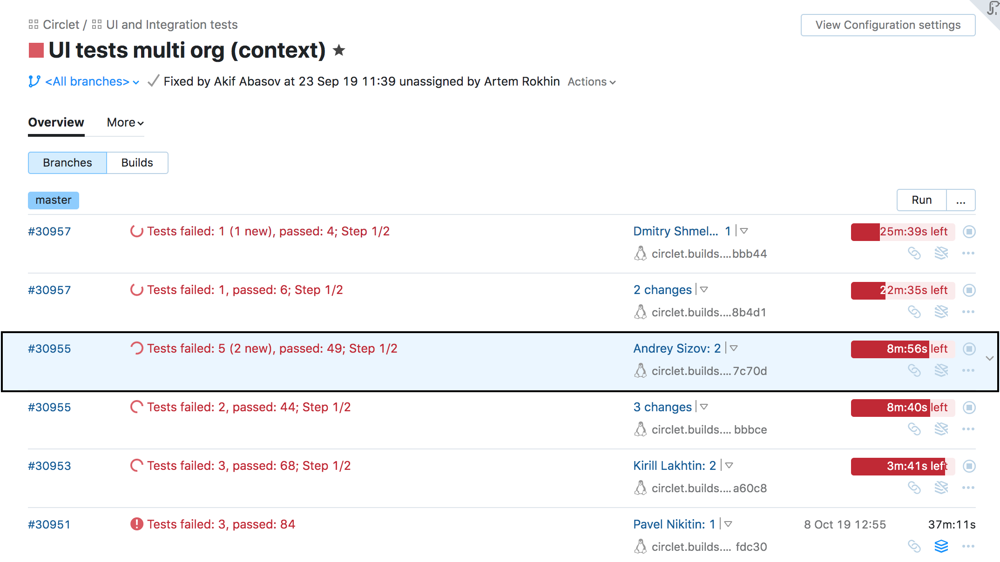
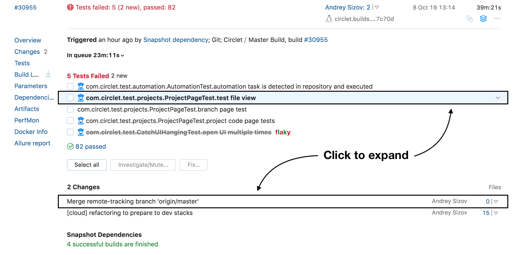

# Builds

If you are working with builds, TeamCity has new exciting possibilities for you.
Now, you can check multiple builds quickly thanks to the __Build Row__ and
__Expanded Build Row__.   
We also redesigned the dedicated __Build Overview Page__. We had two goals in mind:
create shortcuts for popular use-cases, and visualize as much information as possible.  

Below are some screenshots of the new UI, with short descriptions attached to them.
Click on any of the headers to find out what we planned and how we're getting along!

## [Build Row](BuildRow.md)

Each __Build Row__ represents a single build in the build configuration.

## [Expanded Build Row](ExpandedBuildRow.md)

You can click on the free space anywhere in the __Build Row__ and it will expand.

## [Build Page](BuildPage.md)

For in-depth information, you can open the __Build Page__. First, you will end up on
the __Build Overview Tab__. 

