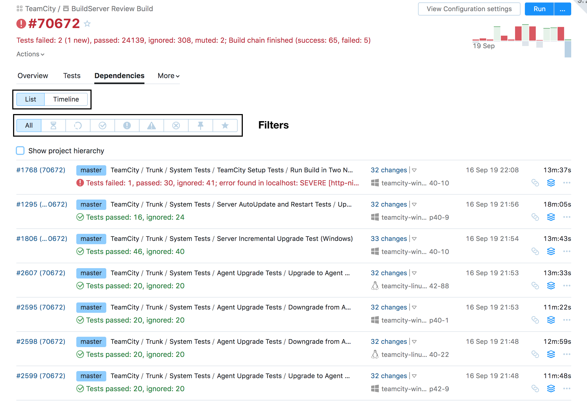

# Dependencies Tab

There are two ways to discover your build dependencies: either as a list or as a timeline.

## List View 

You can list all your dependencies:

Or sort them by their origin:

## Timeline View

The new timeline is here to replace the build chains. 

Clicking on any of the builds will open a pop-up window. Information that might be 
important for the user is highlighted in orange (e.g. 'No available agents').
 