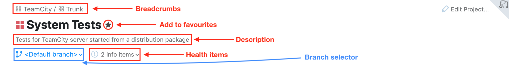
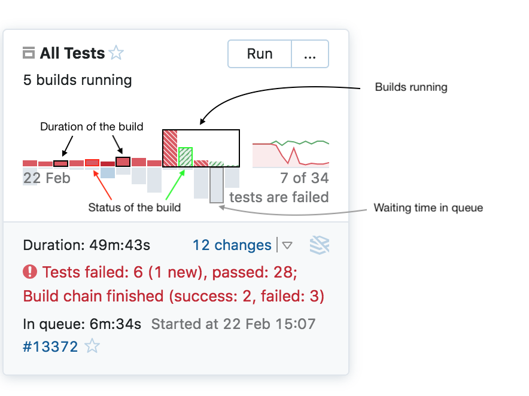

# Project Overview
The __Project Overview__ page is one of the novelties of the Sakura UI update. Whenever you select a project, the first thing you see is the __Trends__ cards displaying some details of the build configurations.

If you prefer, you can switch to the __Builds List__ mode instead.

## Header

* Breadcrumbs  :checkered_flag:
* Title :checkered_flag:
* Branch selector :checkered_flag:
* Add to favorites :checkered_flag:	smart/optional (?)
* Description :checkered_flag:
* Archived :checkered_flag:
* Health items :checkered_flag:

## Trend Cards

* Build status/duration chart :checkered_flag:
* Tests chart :checkered_flag:
* Build details :checkered_flag:
* Minimized/maximized view :checkered_flag:
* Favorite cards first :checkered_flag:

## Build List

* Grouping by build configuration :checkered_flag:
* Favorite builds first :oncoming_automobile:

## Subprojects

At the bottom of the page you can see the subprojects of the selected project. Clicking on any subproject will open its overview.
The overview of the subprojects has the same structure as the overview of the main project.

