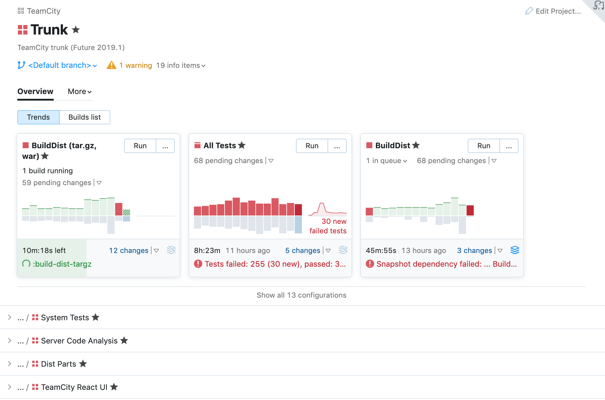

# Sakura

'Sakura' is the internal name of our first project. It is the first step towards
[our vision of the new UI](README.md).
Sakura's focus lies entirely on the __Overview__ and __Build Overview__ pages.

Click on any heading to read the detailed description of the progress made on each feature.

### [Sidebar](sidebar.md)
The redesigned TeamCity __Overview__ now includes a sidebar. Hide it whenever you want to see the details of a project or build configuration, or keep it open to retain the big picture.

### [Project Overview](ProjectOverview.md)
The new __Overview__ page will provide you with a bird-eye view of the selected project
giving you information about your latest build configurations and subprojects.

### [Build Configuration Overview](BuildConfiguration.md)
The __Build Configuration Overview__ page gives you relevant details about the latest builds of the corresponding configuration.

[//]: # (## Configurable Tabs)