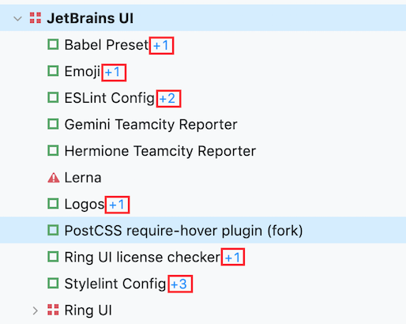
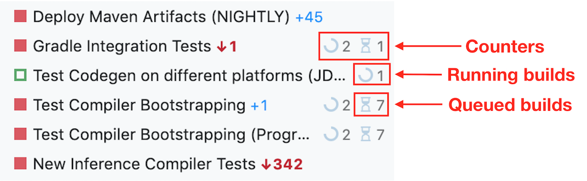
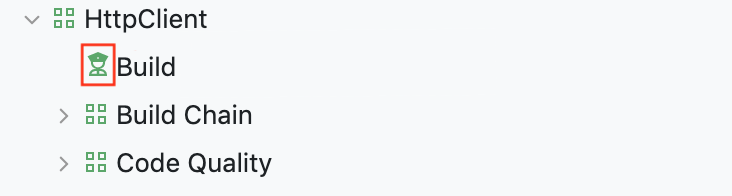
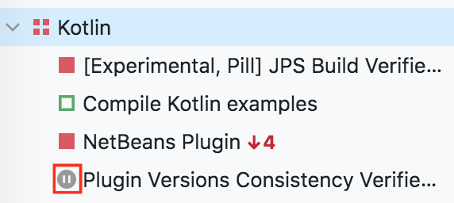

# Sidebar
The sidebar is a big part of the [Sakura](Sakura.md) update.

The new pages are based on the master-detail principle; such a structure has a lot of advantages over the previous overview:
* Better performance, since we only load minimum required data
* Quick and intuitive browsing of projects and build configurations
* Favourites ⭐ are easier to manage
* Bird-eye view of the status of multiple projects and build configurations in one place, even when some project or build configuration is selected

## Search mode 

#### Main functionality :checkered_flag:

#### Add/remove pages to favorites :checkered_flag:

#### Archived project support :checkered_flag:

#### Federation support :checkered_flag: 

     

## Favorites
 
#### Statuses :checkered_flag:
  
  
#### Pending changes :checkered_flag:

#### Running/queued counters :checkered_flag:

#### Investigations :checkered_flag:

#### System problems :checkered_flag:

#### Paused :checkered_flag:

#### Reordering :oncoming_automobile:

## Selected branch support
* Counters (running, queued) in the selected branch
* Pending changes in the selected branch

## General
* Collapse/expand projects :checkered_flag:
* Resize/hide the sidebar :checkered_flag:
* Long names support :checkered_flag:
* Cache
* Failed only

## Keyboard support
* Open with Q :checkered_flag:
* Open with Q when hidden :checkered_flag:
* Open with Cmd + K
* Node navigation
* Hide/show sidebar
 
